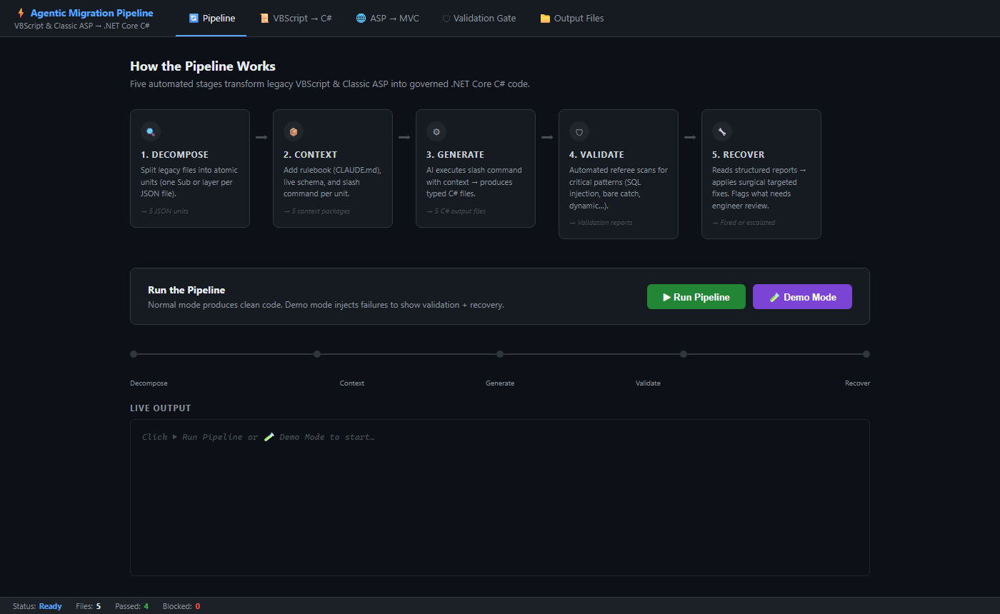

# Agentic Migration Pipeline — Sample Project

A complete, runnable demonstration of a **governed five-stage agentic pipeline** that migrates VBScript and Classic ASP to .NET Core.



---

## Prerequisites

- **Python 3.11+** (no external libraries needed — standard library only)
- **VS Code** with the Python extension installed

---

## Project Structure

```
agentic-pipeline/
│
├── run_pipeline.py                    ← MAIN ENTRY POINT (run this)
│
├── CLAUDE.md                          ← AI rulebook (architecture contracts)
├── migration-patterns.md              ← Legacy → Modern translation dictionary
│
├── .claude/commands/
│   ├── map-vbscript-to-logic.md      ← Slash command: VBScript migration
│   ├── modernize-asp-view.md         ← Slash command: ASP UI layer migration
│   └── refactor-logic.md             ← Slash command: Recovery
│
├── agents/
│   ├── extractor_agent.py            ← Stage 1: Decomposes legacy files
│   ├── context_assembler.py          ← Stage 2: Builds context packages
│   ├── generator.py                  ← Stage 3: Produces C# output
│   ├── enterprise_ai_validation_script.py  ← Stage 4: Validation gate
│   └── recovery_agent.py             ← Stage 5: Targeted fixes
│
├── legacy/
│   ├── vbscript/ProcessOrder.vbs     ← Sample legacy VBScript
│   └── classic-asp/order_detail.asp  ← Sample legacy Classic ASP
│
└── output/                           ← Generated C# files appear here
    ├── Services/
    ├── Controllers/
    ├── ViewModels/
    └── Views/
```

---

## How to Run

### Option 1 — Full pipeline (clean migration, no failures)

```bash
python run_pipeline.py
```

This runs all 5 stages. The generated C# code is clean and passes validation.

---

### Option 2 — Demo mode (shows validation catching failures + recovery fixing them)

```bash
python run_pipeline.py --demo
```

This deliberately injects bad patterns into the generated code at Stage 4, then shows the recovery agent fixing them surgically.

**This is the best option to show Eugene** — it demonstrates the complete loop:
Generate → Validate (catches failures) → Recover (fixes them) → Validate again (passes).

---

### Option 3 — Run each stage individually

```bash
# Stage 1: Extract legacy file units
python agents/extractor_agent.py

# Stage 2: Assemble context packages
python agents/context_assembler.py

# Stage 3: Generate C# output
python agents/generator.py

# Stage 4: Run validation (clean)
python agents/enterprise_ai_validation_script.py

# Stage 4: Run validation (inject failures for demo)
python agents/enterprise_ai_validation_script.py --inject-failure

# Stage 5: Recovery
python agents/recovery_agent.py
```

---

## What You'll See

### After Stage 1 (Extractor)
```
sample-run/stage1-extracted-units/
  vbs_processorder_1.json       ← Sub ProcessOrder unit
  vbs_getordertotal_2.json      ← Sub GetOrderTotal unit
  vbs_cancelorder_3.json        ← Sub CancelOrder unit
  asp_dal_order_detail.json     ← SQL Data Access Layer
  asp_ui_order_detail.json      ← UI/Response Layer
```

### After Stage 3 (Generator)
```
output/
  Services/OrderService.cs        ← Sealed C# service (3 async methods)
  Controllers/OrderController.cs  ← Async controller actions
  ViewModels/OrderDetailViewModel.cs  ← Strongly-typed ViewModel
  Views/Order/Detail.cshtml       ← Razor view (no Response.Write)
```

### After Stage 4 (Validation — demo mode)
```
validation-reports/
  OrderService_report.json    ← BLOCKED: bare catch, dynamic, Session[]
  OrderController_report.json ← PASSED
```

### After Stage 5 (Recovery)
```
  OrderService.cs — surgical fixes applied
  Re-validation: ✅ NOW PASSING
```

---

## The Five Stages Explained

| Stage | File | What It Does |
|-------|------|-------------|
| 1. Decompose | `extractor_agent.py` | Splits legacy files into atomic units (no generation yet) |
| 2. Context Assembly | `context_assembler.py` | Builds rulebook + patterns + live schema package per unit |
| 3. Generation | `generator.py` | Executes slash command → produces typed C# output |
| 4. Validation Gate | `enterprise_ai_validation_script.py` | Scans for CRITICAL/HIGH/MEDIUM regression patterns |
| 5. Recovery | `recovery_agent.py` | Reads structured report → applies surgical targeted fixes |

---

## Key Files to Show Eugene

1. **`CLAUDE.md`** — The AI's non-negotiable architecture contract
2. **`migration-patterns.md`** — COM/SQL/Session → EF Core/typed translation dictionary
3. **`enterprise_ai_validation_script.py`** — The automated referee (no human in the loop yet)
4. **`output/Services/OrderService.cs`** — The clean C# output (before & after)
5. **`validation-reports/*.json`** — Structured failure reports fed back to recovery agent

---

## Connecting to Real Claude API (Production)

In `agents/generator.py`, replace the static template strings with actual API calls:

```python
import anthropic

client = anthropic.Anthropic()  # uses ANTHROPIC_API_KEY env var

response = client.messages.create(
    model="claude-sonnet-4-20250514",
    max_tokens=4000,
    system=context_package["rulebook"],       # CLAUDE.md as system prompt
    messages=[{
        "role": "user",
        "content": context_package["agent_instructions"]  # slash command + unit
    }]
)

generated_code = response.content[0].text
```

Set your API key:
```bash
export ANTHROPIC_API_KEY=your-key-here
```
